# 💻 Day 15 – Error Types (Python)
When coding, typos or mistakes can cause errors. Python shows messages indicating the error type, location, and sometimes suggestions. Understanding these errors helps debug code faster and improves your programming skills.  

Let's explore common **Python errors**. First, open your **terminal** and type **`python`** to launch the **interactive shell**.

**SyntaxError**

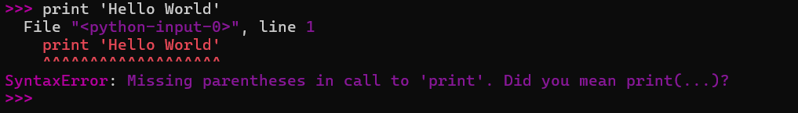

As you can see we made a **syntax error** because we forgot to **enclose** the string with **parenthesis** and Python already suggests the solution. Let us fix it.

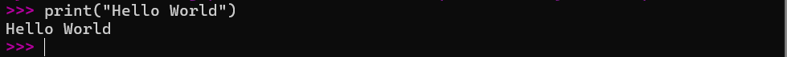

**NameError**

As the message shows, **`age`** is not defined. We tried to print it without declaring it first. Let’s fix this by **declaring** the variable and **assigning** a value.

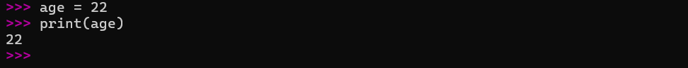

**IndexError**

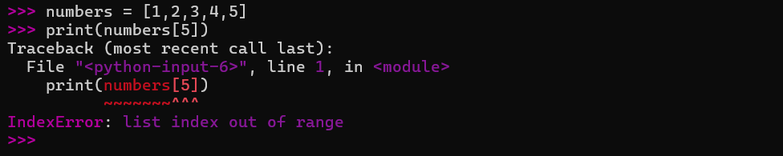

In the example above, Python raised an **IndexError** because the list only has **indexes 0 to 4**, so the accessed index was **out of range**.

**ModuleNotFoundError**

In the example above, adding an extra **`s`** to **`math`** caused a **ModuleNotFoundError**. We can fix it by removing the extra **`s`**.

**AttributeError**

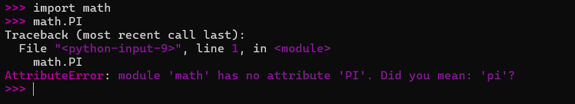

As you can see, I made a mistake! Calling **`PI`** instead of **`pi`** from the **`math`** module raised an **AttributeError**, meaning the attribute doesn't exist. Let's fix it by changing **`PI`** to **`pi`**.

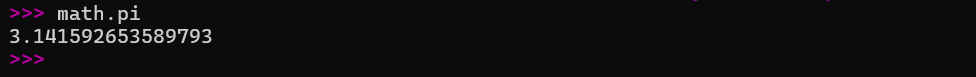

**KeyError**

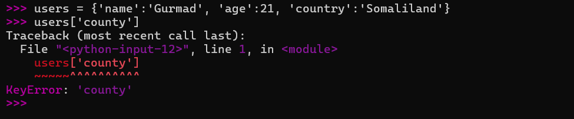

As you can see, there was a typo in the **key** used to access the dictionary, causing a **KeyError**. The fix is straightforward—let's correct the key!

**TypeError**

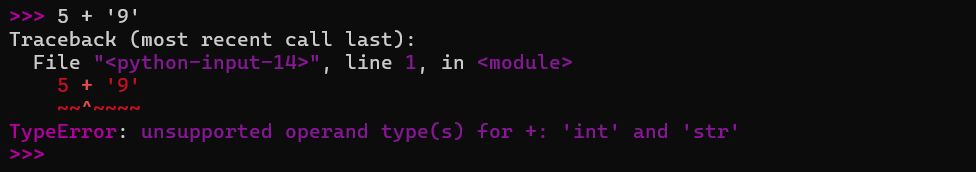

A **TypeError** occurs when adding a **number** to a **string**.  
**Solution 1:** Convert the **string** to **int** or **float**.  
**Solution 2:** Convert the **number** to **string** (result: `'43'`).  

We'll follow **Solution 1**.

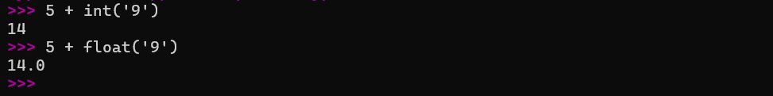

**ImportError**

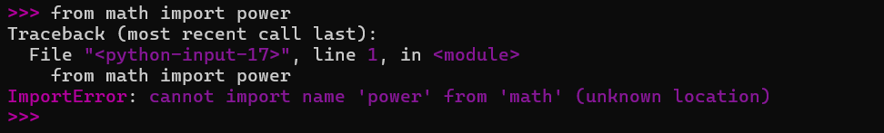

There is no **function** called **power** in the **math** module; use **pow** instead.

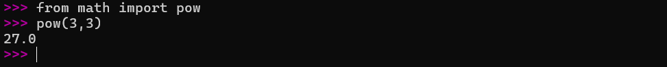

**ValueError**

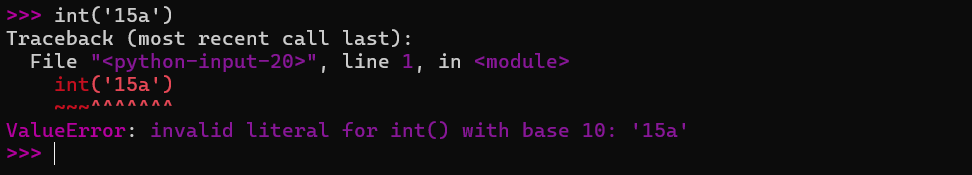

We cannot convert the **string** to a **number** because it contains a **non-numeric character** (`'a'`).

**ZeroDivisionError**

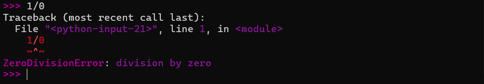
We cannot **divide** a **number** by **zero**.

We covered some **Python error types**. Check the **Python documentation** for more.  
Understanding **errors** helps you **fix bugs faster** and become a **better programmer**.

---
**Gurmad Harir**  
January 27, 2026.